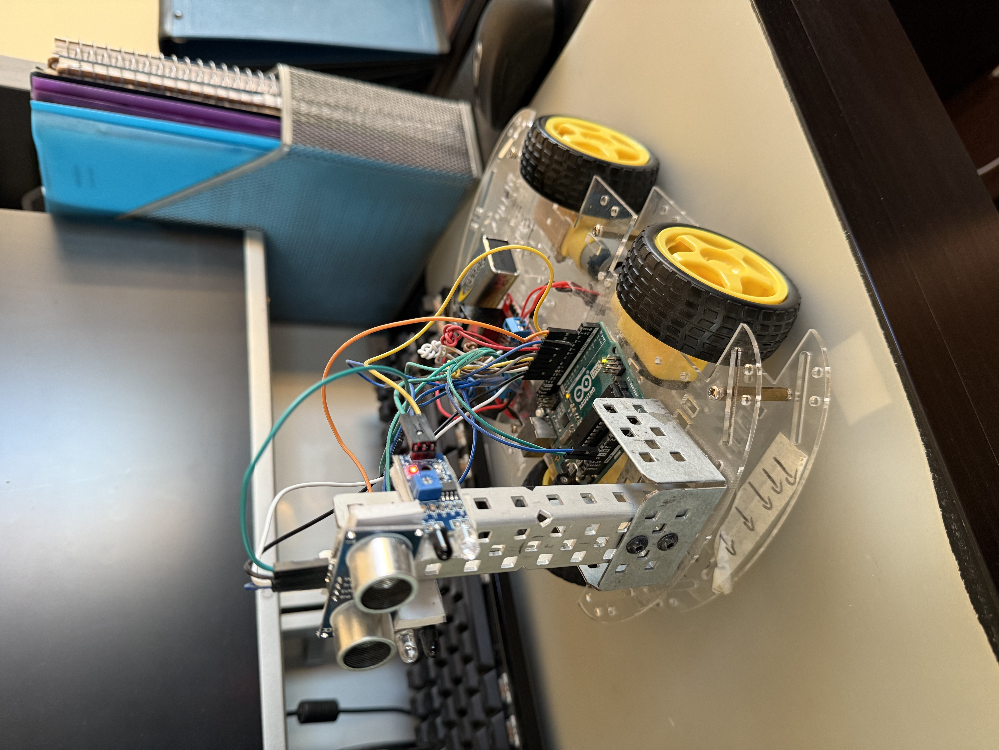
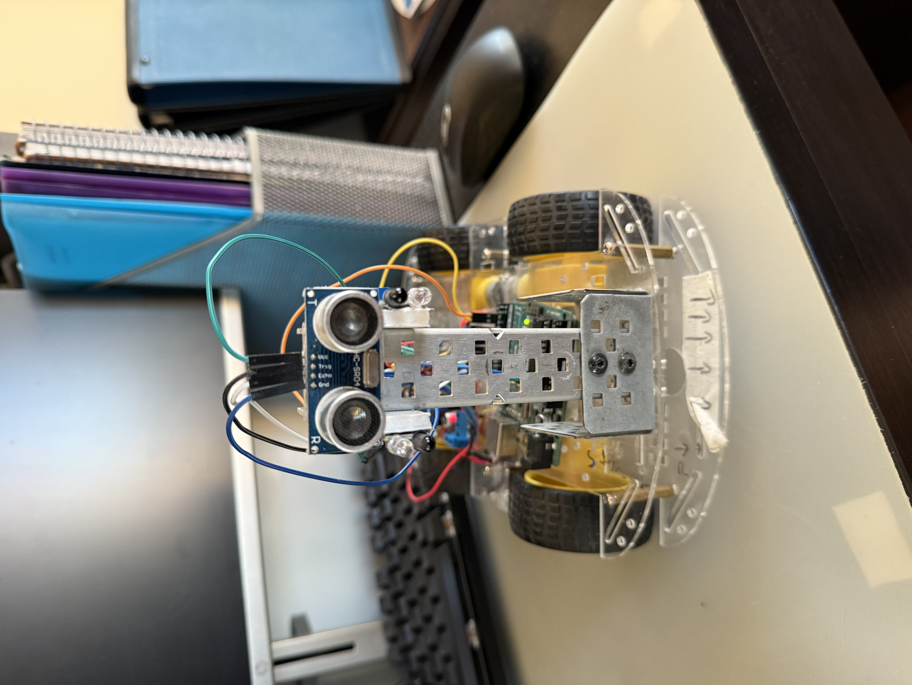
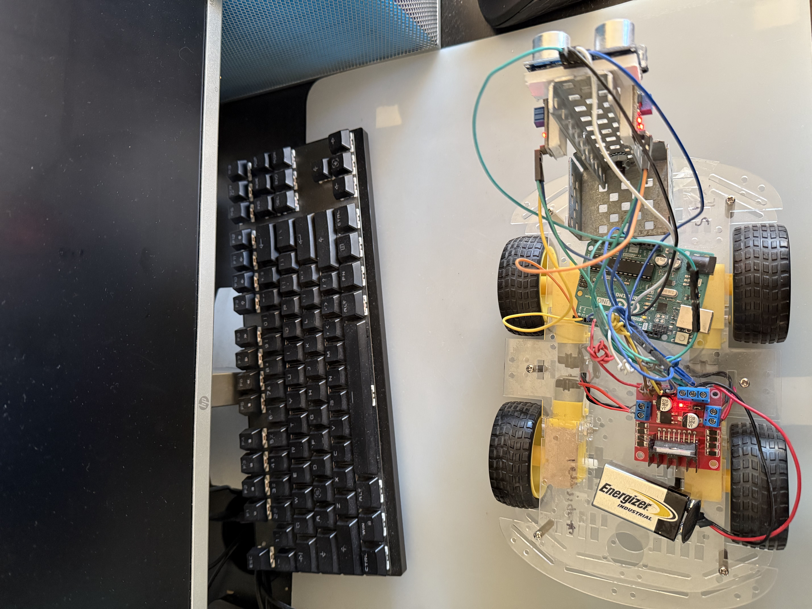

# 🤖 Arduino Human-Following Robot

An autonomous **Arduino-powered robot** that follows a human using **ultrasonic and IR sensors**.  
Built to practice **robotics, sensor integration, motor control, and embedded programming**.

---

## 🚀 Features
- **Human/Obstacle Detection**
  - Ultrasonic sensor (HC-SR04) on a servo for distance measurement and scanning.
  - IR sensors for directional tracking (left/right).

- **Motor Control**
  - 4-wheel chassis driven by an **L293D motor driver module**.
  - Forward, left, right, and stop behaviors based on sensor input.

- **Servo Scanning**
  - Mounted servo sweeps ultrasonic sensor for dynamic tracking.

- **Arduino Integration**
  - Written in C++ with **AFMotor** and **NewPing** libraries.
  - Serial output for debugging distance and IR readings.

---

## 🧠 What I Practiced & Learned
- **Embedded C++**: Working with Arduino libraries and hardware control.
- **Sensor Fusion**: Combining ultrasonic distance sensing with IR sensors.
- **Motor Control**: Speed adjustments and direction control with L293D.
- **Robotics Basics**: Building and wiring a 4-wheel robot chassis.
- **Servo Control**: Using PWM for smooth scanning.

---

## 📦 Components Used
- Arduino Uno  
- HC-SR04 Ultrasonic Sensor  
- IR Sensors (Left & Right)  
- L293D Motor Driver Module  
- Servo Motor (for sensor mount)  
- 4 DC Motors + Chassis + Wheels  
- 7.4–9V Battery Pack  

---

## 📂 Project Structure
```
/Arduino-Human-Following-Robot
├── HumanFollowingRobot.ino   # Main Arduino sketch
├── /images                   # Build and circuit images
```

---

## ⚡ Circuit
Wiring overview with sensors, motor driver, servo, and battery:


---

## 📸 Images
| Build | Front | Top |
|-------|-------|-----|
|  |  |  |

---

## 🛠️ Setup & Usage
1. Install required Arduino libraries:
   - **AFMotor**
   - **NewPing**
2. Upload the code (`HumanFollowingRobot.ino`) to your Arduino Uno.
3. Power the robot via 7.4–9V battery pack or USB.
4. Place the robot in front of a person — it will follow within ~15cm range.

---

## 🎯 Purpose
This project is a **hands-on robotics exercise**, created to explore:
- Sensor-driven movement
- Arduino programming
- Basic autonomous navigation
